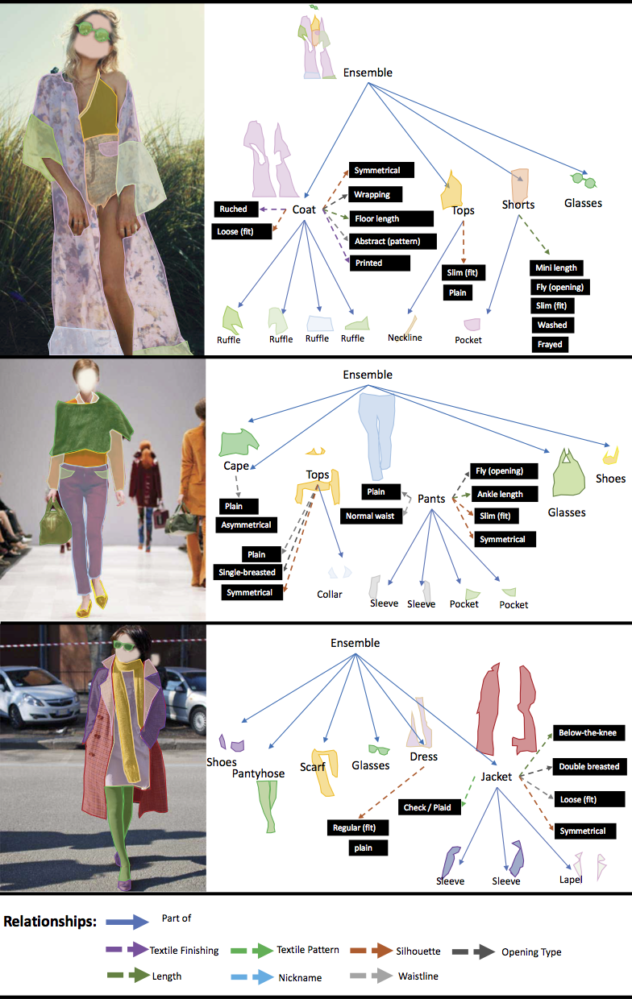

# iMaterialist Competition - Fashion

# 2020 Competition
The 2020 competition, sponsored by Google, is part of the [FGVC7 workshop](https://sites.google.com/view/fgvc7) at [CVPR](http://cvpr2020.thecvf.com/). 

## Details

Visual analysis of clothing is a topic that has received increasing attention in recent years. Being able to recognize apparel products and associated attributes from pictures could enhance shopping experience for consumers, and increase work efficiency for fashion professionals.

We present a new clothing dataset with the goal of introducing **a novel fine-grained segmentation task** by joining forces between the fashion and computer vision communities. The proposed task unifies both categorization and segmentation of rich and complete apparel attributes, an important step toward real-world applications. 

While early work in computer vision addressed related clothing recognition tasks, these are not designed with fashion insiders’ needs in mind, possibly due to the research gap in fashion design and computer vision. To address this, we first propose a fashion taxonomy built by fashion experts, informed by product description from the internet. To capture the complex structure of fashion objects and ambiguity in descriptions obtained from crawling the web, our standardized taxonomy contains **46** apparel objects (**27** main apparel items and **19** apparel parts), and **294** related fine-grained attributes. Secondly, a total of around 48K clothing images in daily-life, celebrity events, and online shopping are labeled by both domain experts and crowd workers for fine-grained segmentation.

In this competition, we challenge you to develop algorithms that will help with an important step towards automatic product detection – to accurately assign segmentations and attribute labels for fashion images. Individuals/Teams with top submissions will be invited to present their work live at the FGVC7 workshop.

For more information on the Evaluation Metric, Data / Submission Format, Rules and participating the 2020 iMaterialist Competition, please see the [Kaggle challenge page](https://www.kaggle.com/c/imaterialist-fashion-2020-FGVC7).

## Dataset Details

Apparel instance segmentations include 27 main apparel objects  (jackets, dresses, skirts, etc) and 19 apparel parts (sleeves, collars, etc). A total of 294 fine-grained attributes was annotated by expert for main apparel objects. 

We present a new clothing dataset with the goal of introducing **a novel fine-grained segmentation task** by joining forces between the fashion and computer vision communities. The proposed task unifies both categorization and segmentation of rich and complete apparel attributes, an important step toward real-world applications.

#### Annotation Format

For iMat-Fashion competitions, our annotations are in csv format. Please refer to our [Kaggle page](https://www.kaggle.com/c/imaterialist-fashion-2020-FGVC7/overview/evaluation) for annotation details.

We also provide an alternativel annotation format, following the annotation format of the [COCO dataset](http://mscoco.org/dataset/#download) with additonal fields, such as attributes. Check out [here](https://github.com/cvdfoundation/fashionpedia) for more details and download links. 

#### Evaluation

Additional to the kaggle site, we provide additional evaluation metrics following COCO. The use of this evaluation metrics is *recommended*, for better benchmarking the progress of the proposed new task. Details are [here](https://github.com/KMnP/fashionpedia-api). 

## Differences from iMat Fashion 2019/2018/2017

Whereas iMat-Fashion-2018 and 2017 covered fine-grained attributes classification, in the year of 2020 and 2019, our competition introduces a novel task, which is to jointly learn apparel instance segmentation with fine-grained attributes classification. Both our 2019 and 2020 datasets propose a fashion taxonomy built by fashion experts. The 2020 version has more fine-grained attributes (294 attributes) than 2019 version (92).

For more details on previous iMat Fashion challenges, please see:

1. [2019 kaggle site](https://www.kaggle.com/c/imaterialist-fashion-2019-FGVC6), [github page](https://github.com/visipedia/imat_comp/tree/master/2019)
2. [2018 kaggle site](https://www.kaggle.com/c/imaterialist-challenge-fashion-2018), [github page](https://github.com/visipedia/imat_fashion_comp)
3. [2017 github page](https://github.com/visipedia/imat_comp/tree/master/2017)

## Contact

- Menglin Jia (mj493@cornell.edu)
- Mengyun (David) Shi (ms2979@cornell.edu)

## Acknowledgements

The iMat-Fashion Challenge 2019 is sponsored by Google AI, CVDF, Samasource and [Fashionpedia](https://fashionpedia.github.io/home/index.html).

